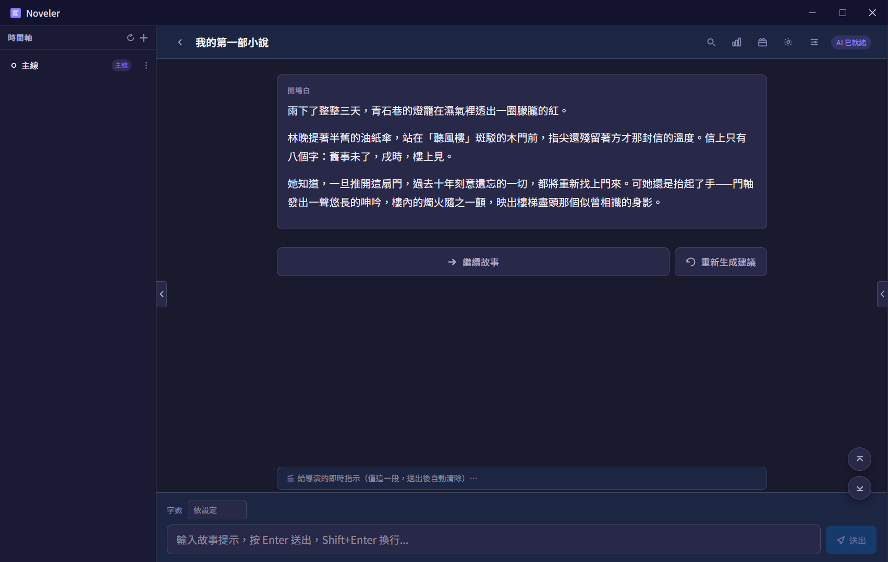

# Noveler — AI Novel Writer

**AI 互動小說生成器** · Co-write long-form fiction with any LLM, right on your desktop.

[](LICENSE)

[](https://www.electronjs.org/)

[](https://react.dev/)

[](https://www.typescriptlang.org/)

[](https://nodejs.org/about/releases)

[English](README.md) · [繁體中文](README.zh-TW.md)

Noveler is a free, open-source **AI writing app** for authors of long-form fiction. Write or paste an opening, then drive the story forward turn by turn with plain-language author directives — the AI writes the prose while you stay the director. A built-in **Director** plans plot beats ahead, a persistent **World Memory** tracks characters, relationships and events, and automatic editor passes refine dialogue and narration as you go.

Bring your own model: connect **OpenAI**, **OpenRouter**, any **OpenAI-compatible** endpoint, or run fully offline with local **[Ollama](https://ollama.com/)**. The interface is in Traditional Chinese (繁體中文) and tuned for web-novel / 網文 style storytelling, but the engine works with any language your model supports.

> Keywords: AI novel writer · LLM creative writing · interactive fiction generator · 小說生成器 · 網文/爽文 co-writing · Electron desktop app · OpenAI / OpenRouter / Ollama · 繁體中文 AI 寫作



## Why Noveler

- **You direct, the AI writes.** Each message is treated as an author directive, not finished prose — you steer tone, pacing and plot without touching a prompt template.
- **The story stays coherent.** World Memory + Director keep characters, relationships and plot beats consistent across tens of thousands of words.
- **Your keys, your models, your data.** Everything runs locally in an Electron app; projects are plain files on your disk, and API keys are stored encrypted.

## Features

- **Turn-based story generation** — stream story continuations from your chosen model; chat input is framed as an author directive rather than completed narration.
- **World Memory** — characters, relationships and events persisted per project, auto-updated as the story advances and editable by hand. Import from JSON files or pasted text.
- **Director / plot planning** — maintains a rolling roadmap of upcoming plot beats and injects scene-continuity directives so the narrative stays coherent.
- **Full-story generation** — describe a premise and target length and let Noveler plan and write an entire draft section by section.
- **Editor passes** — dialogue editor, narration editor, writing-style and plot-compliance configuration to shape tone and quality.
- **Branching & versions** — timeline tree with branch create/switch/rename, paragraph regeneration, version switching and rollback.
- **Multiple AI providers** — any OpenAI-compatible endpoint, OpenRouter (with credit display), and local [Ollama](https://ollama.com/). OpenAI/ChatGPT sign-in via OAuth device flow is also supported.
- **Context budgeting** — token accounting with `js-tiktoken`, a context-budget indicator, and story compaction ("前情提要") to stay within the model's context window.
- **Search** — full-text search plus character/event lookup across the project.
- **Autosave & crash recovery** — periodic snapshots with recovery prompts on restart.
- **Project templates**, story stats, onboarding wizard, dark/light/system themes, and adjustable font size.
- **Import existing novels** from `.txt` / `.md` into a project.

## Quick Start

```sh
# clone the project
git clone https://github.com/LizardLiang/noveler.git
cd noveler

# install dependencies
pnpm install

# start development
pnpm dev
```

Requires Node.js `>= 20.19.0 || >= 22.12.0`.

Then open **Settings**, add an AI provider (OpenAI API key, OpenRouter, a local Ollama URL, or OAuth sign-in), create a project, and start writing.

## Available Scripts

- `pnpm dev` — start the Vite dev server with Electron.
- `pnpm build` — build the renderer and package the app with electron-builder.
- `pnpm release` — build and package without publishing (`release:win` / `release:mac` / `release:dir` for targeted builds).
- `pnpm preview` — preview the production web build locally.
- `pnpm test` — run Vitest unit tests.
- `pnpm test:e2e` — build the test bundle and run Playwright tests.
- `pnpm typecheck` — run the TypeScript type checker.

## Tech Stack

- **Electron** + **Vite** + **React 19** + **TypeScript**
- **TailwindCSS v4** for styling
- **Zustand** for renderer state
- **sql.js** for per-project SQLite storage (characters, events, paragraphs, branches)
- **openai** SDK for streaming completions; native transports for Ollama and OAuth/curl
- **zod** for schema validation, **react-router-dom** (hash router), **react-markdown**

## Project Structure

```tree
├── electron/             Main-process and preload source
│   ├── main/
│   │   └── services/     AI, World Memory, Director, editors, storage, OAuth, search…
│   ├── ipc/              IPC channel handlers
│   ├── preload/
│   └── shared/           Types shared between main and renderer
├── src/                  Renderer source code
│   ├── components/       UI: story, worldMemory, settings, sidebar, search, stats…
│   ├── pages/            ProjectList, Story, Settings
│   ├── stores/           Zustand stores
│   ├── hooks/
│   ├── layouts/
│   └── i18n/             zh-TW strings
├── build/                Packaging assets
├── dist-electron/        Compiled Electron output
└── test/                 Unit and end-to-end tests
    └── e2e/
```

Files under `electron/` are compiled into `dist-electron/`.

## Configuration

AI providers are configured in the in-app **Settings** page — add an OpenAI-compatible base URL and API key, connect OpenRouter, point at a local Ollama instance, or sign in via OAuth. API keys are stored encrypted on disk. Writing style, dialogue/narration editing, plot compliance and the system prompt are all editable from Settings as well.

## Contributing

Issues and pull requests are welcome. Please run `pnpm typecheck` and `pnpm test` before opening a PR.

## License

MIT © [LizardLiang](https://github.com/LizardLiang)

<sub>Built on the [electron-vite-react](https://github.com/electron-vite/electron-vite-react) template.</sub>
